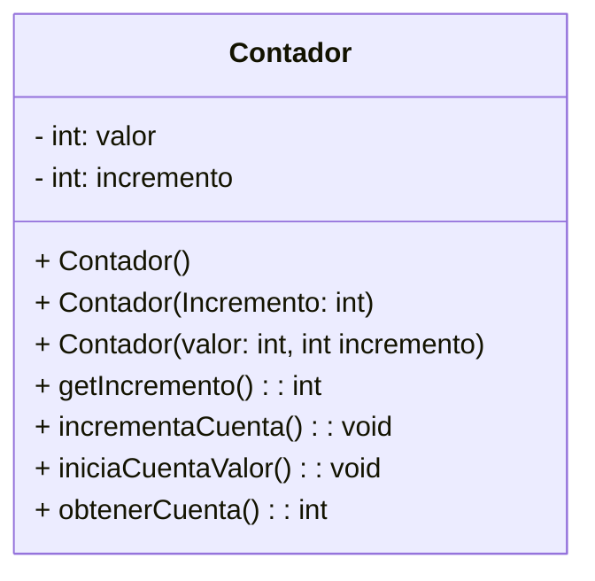

```mermaid
    classDiagram
        class Contador {
            - int: valor
            - int: incremento
            + Contador()
            + Contador(Incremento: int) 
            + Contador(valor: int, int incremento)
            + getIncremento() : int
            + incrementaCuenta() : void
            + iniciaCuentaValor() : void
            + obtenerCuenta() : int
        }
```