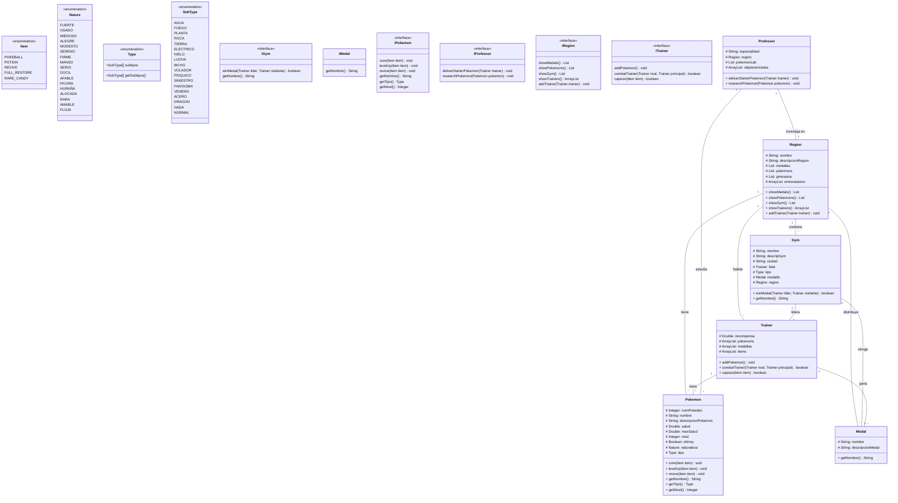

```mermaid
    classDiagram
    %% Enumeraciones
    class Item {
        <<enumeration>>
        POKEBALL
        POTION
        REVIVE
        FULL_RESTORE
        RARE_CANDY
    }

    class Nature {
        <<enumeration>>
        FUERTE
        OSADO
        MIEDOSO
        ALEGRE
        MODESTO
        SERENO
        FIRME
        MANSO
        SERIO
        DOCIL
        AFABLE
        PICARA
        HURAÑA
        ALOCADA
        RARA
        AMABLE
        FLOJA
    }

    class Type {
        <<enumeration>>
        +SubType[] subtipos
        +SubType[] getSubtipos()
    }

    class SubType {
        <<enumeration>>
        AGUA
        FUEGO
        PLANTA
        ROCA
        TIERRA
        ELECTRICO
        HIELO
        LUCHA
        BICHO
        VOLADOR
        PSIQUICO
        SINIESTRO
        FANTASMA
        VENENO
        ACERO
        DRAGON
        HADA
        NORMAL
    }

    %% Interfaces
    class iGym {
        <<interface>>
        winMedal (Trainer lider, Trainer visitante) boolean
        getNombre() String
    }

    class iMedal {
        getNombre() String
    }

    class iPokemon {
        <<interface>>
        cure (Item item) void
        levelUp (Item item) void
        revive (Item item) void
        getNombre() String
        getTipo() Type
        getNivel() Integer
    }

    class iProfessor {
        <<interface>>
        deliverStarterPokemon (Trainer trainer) void
        researchPokemon (Pokemon pokemon) void
    }

    class iRegion {
        <<interface>>
        showMedals() List<Medal> 
        showPokemons() List<Pokemon> 
        showGym() List<Gym> 
        showTrainers() ArrayList<Trainer> 
        addTrainer (Trainer trainer) void 
    }

    class iTrainer {
        <<interface>>
        addPokemon() void 
        combatTrainer(Trainer rival, Trainer principal) boolean 
        capture(Item item) boolean 
    }

    %% Clases
    class Gym {
        # String: nombre
        # String: descripGym
        # String: ciudad
        # Trainer: lider
        # Type: tipo
        # Medal: medalla
        # Region: region
        
        + winMedal (Trainer lider, Trainer visitante) boolean
        + getNombre() String
    }

    class Medal {
        # String: nombre
        # String: descripcionMedal

        + getNombre() String
    }

    class Pokemon {
        # Integer: numPokedex
        # String: nombre
        # String: descripcionPokemon
        # Double: salud
        # Double: maxSalud
        # Integer: nivel
        # Boolean: shinny
        # Nature: naturaleza
        # Type: tipo

        + cure (Item item) void
        + levelUp (Item item) void
        + revive (Item item) void
        + getNombre() String
        + getTipo() Type
        + getNivel() Integer
    }

    class Professor {
        # String: especialidad
        # Region: region
        # List<Pokemon>: pokemonLab
        # ArrayList<Item>: objetosIniciales

        + deliverStarterPokemon (Trainer trainer) void
        + researchPokemon (Pokemon pokemon) void
    }

    class Region {
        # String: nombre
        # String: descripcionRegion
        # List<Medal>: medallas
        # List<Pokemon>: pokemons
        # List<Gym>: gimnasios
        # ArrayList<Trainer>: entrenadores

        + showMedals() List<Medal>
        + showPokemons() List<Pokemon>
        + showGym() List<Gym>
        + showTrainers() ArrayList<Trainer>
        + addTrainer (Trainer trainer) void
    }

    class Trainer {
        # Double: recompensa
        # ArrayList<Pokemon>: pokemons
        # ArrayList<Medal>: medallas
        # ArrayList<Item>: items

        + addPokemon() void
        + combatTrainer(Trainer rival, Trainer principal) boolean
        + capture(Item item) boolean
    }

    %% Relaciones
    Region "1" -- "*" Gym : contiene
    Region "1" -- "*" Trainer : habita
    Region "1" -- "*" Pokemon : tiene
    Region "1" -- "*" Medal : distribuye

    Gym "1" -- "1" Trainer : lidera
    Gym "1" -- "1" Medal : otorga

    Trainer "1" -- "*" Pokemon : tiene
    Trainer "1" -- "*" Medal : gana

    Professor "1" -- "1" Region : investiga en
    Professor "1" -- "*" Pokemon : estudia

```