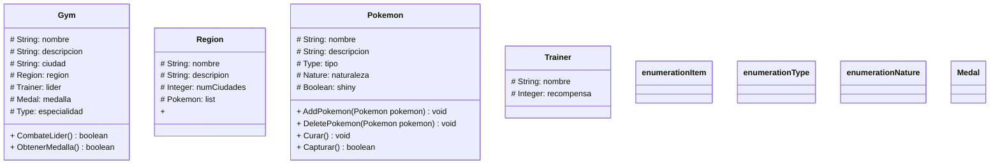

```mermaid
    classDiagram

        class Gym {
            # String: nombre
            # String: descripcion
            # String: ciudad
            # Region: region
            # Trainer: lider
            # Medal: medalla
            # Type: especialidad

            + CombateLider() boolean
            + ObtenerMedalla() boolean
        }

        class Region {
            # String: nombre
            # String: descripion
            # Integer: numCiudades
            # Pokemon: list

            + 
        }

        class Pokemon {
            # String: nombre
            # String: descripcion
            # Type: tipo
            # Nature: naturaleza
            # Boolean: shiny

            + AddPokemon (Pokemon pokemon) void
            + DeletePokemon (Pokemon pokemon) void
            + Curar () void
            + Capturar () boolean
        }

        class Trainer {
            # String: nombre
            # Integer: recompensa

        }

        class enumeration Item {

        }

        class enumeration Type {

        }

        class enumeration Nature {

        }

        class Medal {

        }


```