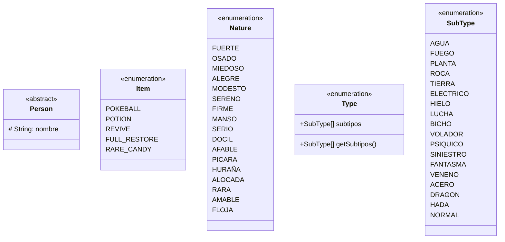
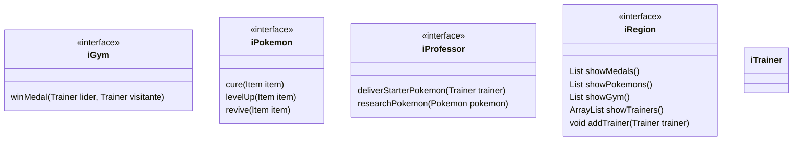
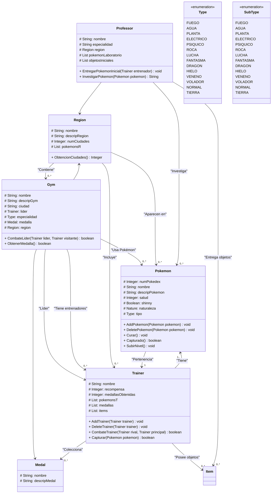

```mermaid
    classDiagram

        class Person {
            <<abstract>>
            # String: nombre
        }

        class Item {
            <<enumeration>>
            POKEBALL
            POTION
            REVIVE
            FULL_RESTORE
            RARE_CANDY
        }

        class Nature {
            <<enumeration>>
            FUERTE
            OSADO
            MIEDOSO
            ALEGRE
            MODESTO
            SERENO
            FIRME
            MANSO
            SERIO
            DOCIL
            AFABLE
            PICARA
            HURAÑA
            ALOCADA
            RARA
            AMABLE
            FLOJA
        }

        class Type {
            <<enumeration>>
            +SubType[] subtipos

            +SubType[] getSubtipos()
        }

        class SubType {
            <<enumeration>>
            AGUA
            FUEGO
            PLANTA
            ROCA
            TIERRA
            ELECTRICO
            HIELO
            LUCHA
            BICHO
            VOLADOR
            PSIQUICO
            SINIESTRO
            FANTASMA
            VENENO
            ACERO
            DRAGON
            HADA
            NORMAL
        }
```

---

```mermaid

    classDiagram

        class iGym {
            <<interface>>
            winMedal (Trainer lider, Trainer visitante)
        }

        class iPokemon {
            <<interface>>
            cure (Item item)
            levelUp (Item item)
            revive (Item item)
        }

        class iProfessor {
            <<interface>>
            deliverStarterPokemon (Trainer trainer)
            researchPokemon (Pokemon pokemon)
        }

        class iRegion {
            <<interface>>
            List<Medal> showMedals()
            List<Pokemon> showPokemons()
            List<Gym> showGym()
            ArrayList<Trainer> showTrainers()
            void addTrainer (Trainer trainer)
        }

        class iTrainer {
            
        }


```

---

```mermaid
    classDiagram

        class Region {
            # String: nombre
            # String: descripRegion
            # Integer: numCiudades
            # List<Pokemon>: pokemonsR

            + ObtencionCiudades () Integer
        }

        class Gym {
            # String: nombre
            # String: descripGym
            # String: ciudad
            # Trainer: lider
            # Type: especialidad
            # Medal: medalla
            # Region: region

            + CombateLider (Trainer lider, Trainer visitante) boolean
            + ObtenerMedalla () boolean
        }

        class Pokemon {
            # Integer: numPokedex
            # String: nombre
            # String: descripPokemon
            # Integer: salud
            # Boolean: shinny
            # Nature: naturaleza
            # Type: tipo

            + AddPokemon (Pokemon pokemon) void
            + DeletePokemon (Pokemon pokemon) void
            + Curar () void
            + Capturado () boolean
            + SubirNivel () void
        }

        class Trainer {
            # String: nombre
            # Integer: recompensa
            # Integer: medallasObtenidas
            # List<Pokemon>: pokemonsT
            # List<Medal>: medallas
            # List<Item>: items

            + AddTrainer (Trainer trainer) void
            + DeleteTrainer (Trainer trainer) void
            + CombateTrainer (Trainer rival, Trainer principal) boolean
            + Capturar (Pokemon pokemon) boolean
        }

        class Professor {
            # String: nombre
            # String especialidad
            # Region region
            # List<Pokemon> pokemonLaboratorio
            # List<Item> objetosIniciales

            + EntregarPokemonInicial (Trainer entrenador) void
            + InvestigarPokemon (Pokemon pokemon) String
        }

        class Medal {
            # String: nombre
            # String: descripMedal
        }


        class Type {
            <<enumeration>>
            FUEGO
            AGUA
            PLANTA
            ELECTRICO
            PSIQUICO
            ROCA
            LUCHA
            FANTASMA
            DRAGON
            HIELO
            VENENO
            VOLADOR
            NORMAL
            TIERRA 
        }

        class SubType {
            <<enumeration>>
            FUEGO
            AGUA
            PLANTA
            ELECTRICO
            PSIQUICO
            ROCA
            LUCHA
            FANTASMA
            DRAGON
            HIELO
            VENENO
            VOLADOR
            NORMAL
            TIERRA 
        }


    Gym --> Region
    Gym --> Trainer : "Líder"
    Gym --> Medal
    Gym --> "0..*" Trainer : "Tiene entrenadores"
    Gym --> "0..*" Pokemon : "Usa Pokémon"

    Trainer --> "1.." Pokemon : "Tiene"
    Trainer --> "0..*" Medal : "Colecciona"
    Trainer --> "0..*" Item : "Posee objetos"

    Region --> "0..*" Pokemon : "Aparecen en"
    Region --> "0..*" Gym : "Contiene"
    Region --> "0..*" Trainer : "Incluye"

    Pokemon --> "1" Trainer : "Pertenencia"

    Professor --> Region
    Professor --> "0..*" Pokemon : "Investiga"
    Professor --> "0..*" Item : "Entrega objetos"

```