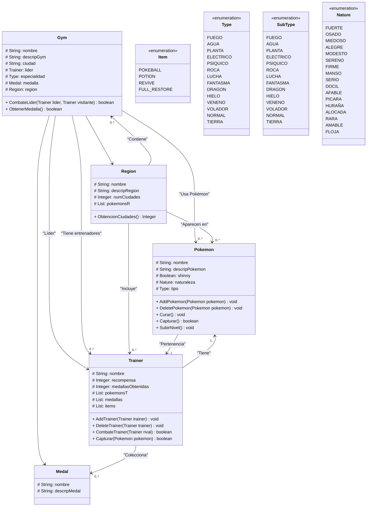

```mermaid
    classDiagram

        class Gym {
            # String: nombre
            # String: descripGym
            # String: ciudad
            # Trainer: lider
            # Type: especialidad
            # Medal: medalla
            # Region: region

            + CombateLider (Trainer lider, Trainer visitante) boolean
            + ObtenerMedalla () boolean
        }

        class Region {
            # String: nombre
            # String: descripRegion
            # Integer: numCiudades
            # List<Pokemon>: pokemonsR

            + ObtencionCiudades () Integer
        }

        class Pokemon {
            # String: nombre
            # String: descripPokemon
            # Boolean: shinny
            # Nature: naturaleza
            # Type: tipo

            + AddPokemon (Pokemon pokemon) void
            + DeletePokemon (Pokemon pokemon) void
            + Curar () void
            + Capturar () boolean
            + SubirNivel () void
        }

        class Trainer {
            # String: nombre
            # Integer: recompensa
            # Integer: medallasObtenidas
            # List<Pokemon>: pokemonsT
            # List<Medal>: medallas
            # List<Item>: items

            + AddTrainer (Trainer trainer) void
            + DeleteTrainer (Trainer trainer) void
            + CombateTrainer (Trainer rival) boolean
            + Capturar (Pokemon pokemon) boolean
        }

        class Medal {
            # String: nombre
            # String: descripMedal
        }

        class Item {
            <<enumeration>>
            POKEBALL
            POTION
            REVIVE
            FULL_RESTORE
        }

        class Type {
            <<enumeration>>
            FUEGO
            AGUA
            PLANTA
            ELECTRICO
            PSIQUICO
            ROCA
            LUCHA
            FANTASMA
            DRAGON
            HIELO
            VENENO
            VOLADOR
            NORMAL
            TIERRA 
        }

        class SubType {
            <<enumeration>>
            FUEGO
            AGUA
            PLANTA
            ELECTRICO
            PSIQUICO
            ROCA
            LUCHA
            FANTASMA
            DRAGON
            HIELO
            VENENO
            VOLADOR
            NORMAL
            TIERRA 
        }

        class Nature {
            <<enumeration>>
            FUERTE
            OSADO
            MIEDOSO
            ALEGRE
            MODESTO
            SERENO
            FIRME
            MANSO
            SERIO
            DOCIL
            AFABLE
            PICARA
            HURAÑA
            ALOCADA
            RARA
            AMABLE
            FLOJA
        }

    Gym --> Region
    Gym --> Trainer : "Líder"
    Gym --> Medal
    Gym --> "0..*" Trainer : "Tiene entrenadores"
    Gym --> "0..*" Pokemon : "Usa Pokémon"

    Trainer --> "1.." Pokemon : "Tiene"
    Trainer --> "0..*" Medal : "Colecciona"

    Region --> "0..*" Pokemon : "Aparecen en"
    Region --> "0..*" Gym : "Contiene"
    Region --> "0..*" Trainer : "Incluye"

    Pokemon --> "1" Trainer : "Pertenencia"

```