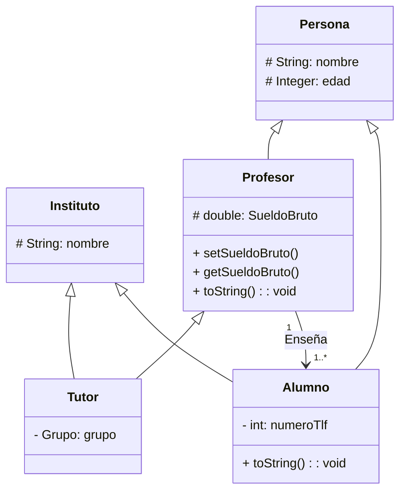

```mermaid
    classDiagram

        class Instituto {
            # String: nombre 
        }

        class Persona {
            # String: nombre
            # Integer: edad
        }

        class Alumno {
            - int: numeroTlf
            + toString(): void
        }

        class Profesor {
            # double: SueldoBruto
            + setSueldoBruto()
            + getSueldoBruto() 
            + toString(): void
        }

        class Tutor {
            - Grupo: grupo
        }

    Persona <|-- Profesor
    Persona <|-- Alumno
    Profesor <|-- Tutor
    Instituto <|-- Tutor
    Instituto <|-- Alumno

    Profesor "1" --> "1..*" Alumno: Enseña
    
```