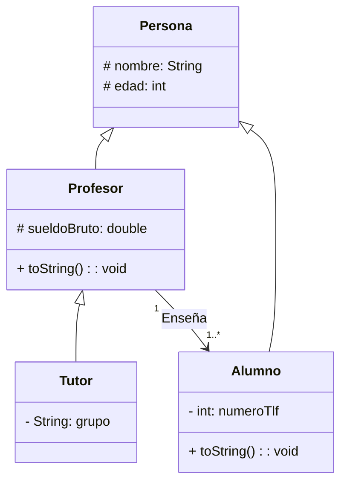

```mermaid
    classDiagram

        class Persona {
            # nombre: String
            # edad: int
        }

        class Profesor {
            # sueldoBruto: double
            + toString() : void
        }

        class Alumno {
            - int: numeroTlf
            + toString() : void
        }

        class Tutor {
            - String: grupo
        }

    Persona <|-- Profesor
    Persona <|-- Alumno
    Profesor <|-- Tutor

    Profesor "1" --> "1..*" Alumno: Enseña
```