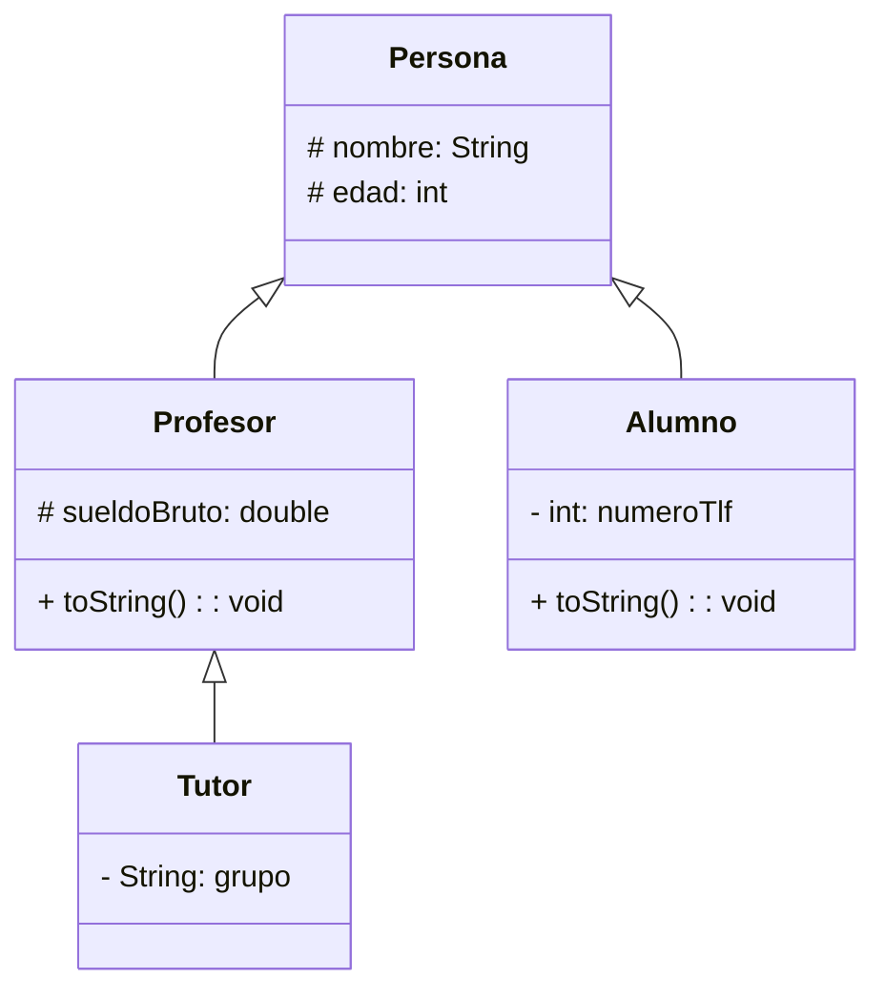

```mermaid
    classDiagram

    enum Genero {
        DRAMA
        COMEDIA
        ACCION
        TERROR
        ROMANCE
        AVENTURA
        SCIFI
    }

    class Pelicula {
        # String: titulo
        # String: Sinopsis
        # int: anio
        # genero: Genero 
    }

    class Persona {
        - 
    }