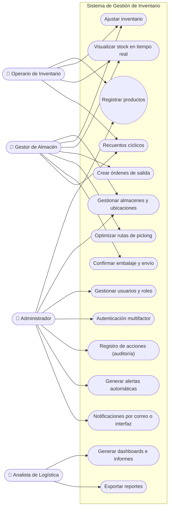
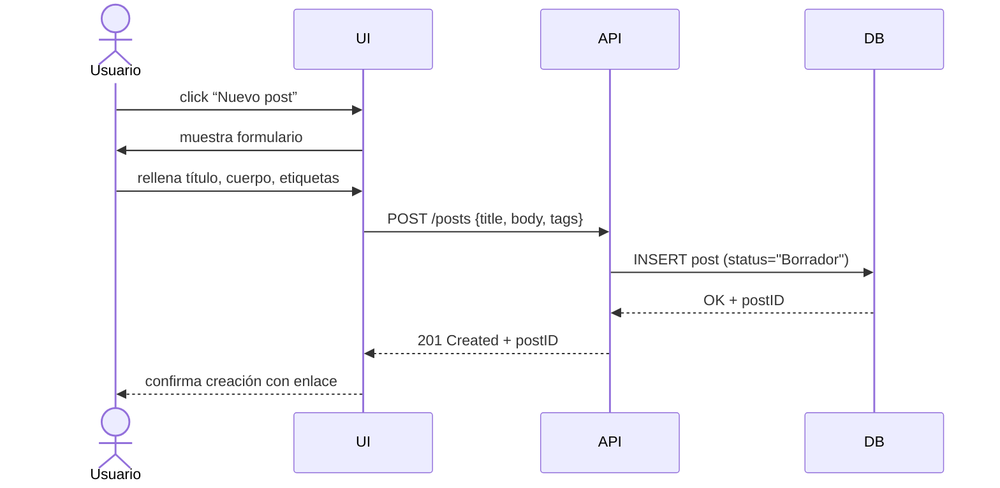
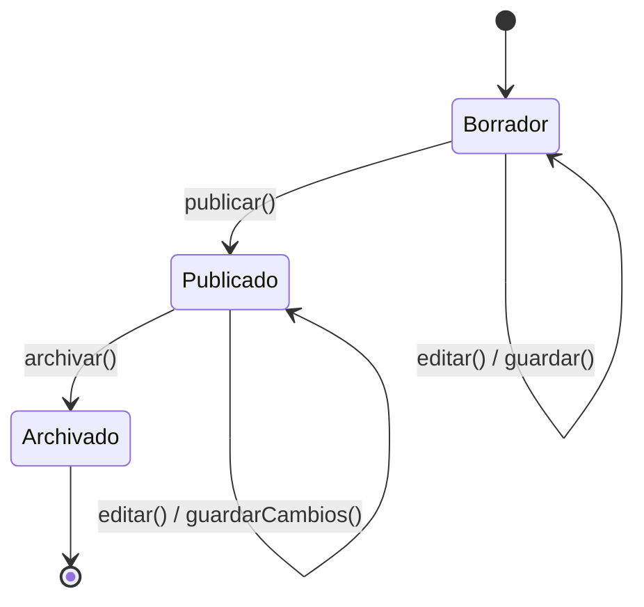
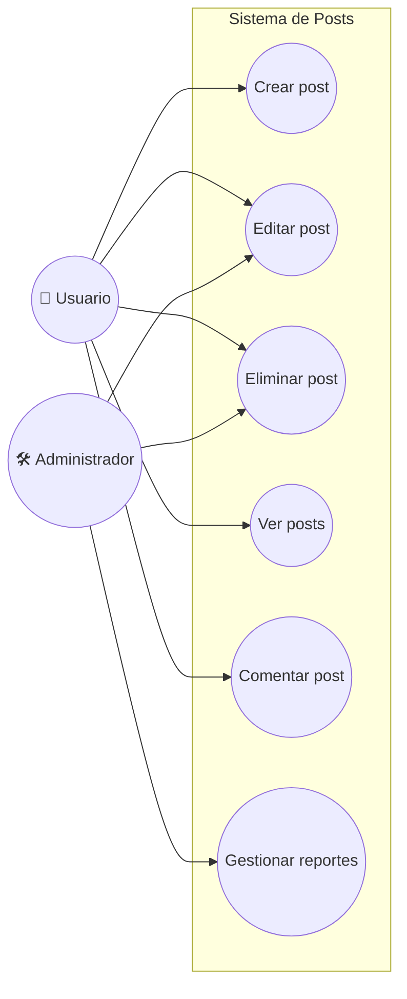
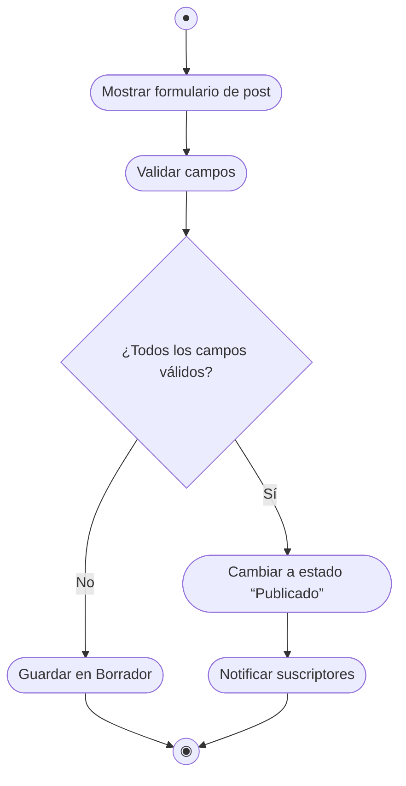

#  Plataforma Web de Gestión Integral de Almacenes y Stock.

# Descripción General.

Desarrollar una plataforma web donde los usuarios puedan registrarse e iniciar sesión, y una vez autenticados crear, editar, archivar o eliminar sus propios posts. Cada post incluirá un título, cuerpo y etiquetas, y podrá verse en un listado paginado y filtrado por etiquetas. Los usuarios también podrán comentar en los posts publicados. Habrá un rol de “Administrador” con capacidad adicional de moderar contenido (eliminar posts o comentarios inapropiados).

---

## 2. Objetivos del Proyecto

| **ID** | **Objetivo SMART**                                                                 | **Tipo**    | **Métrica**                                | **Fecha Límite** | **Responsable**                     | **Estado**  |
| ------ | ---------------------------------------------------------------------------------- | ----------- | ------------------------------------------ | ---------------- | ----------------------------------- | ----------- |
| OBJ-01 | Implementar un sistema modular y escalable para gestionar inventarios y almacenes. | Estratégico | Despliegue completo en entorno productivo  | 2025-12-31       | Equipo de desarrollo, Administrador | No iniciado |
| OBJ-02 | Visualizar niveles de stock en tiempo real en todos los almacenes y ubicaciones.   | Operativo   | Tiempo de actualización de stock ≤ 5 s     | 2025-09-30       | Gestor de almacén, Backend          | En progreso |
| OBJ-03 | Automatizar alertas por umbrales de stock y productos próximos a caducar.          | Técnico     | % de alertas generadas correctamente ≥ 98% | 2025-08-31       | Desarrolladores, Administrador      | No iniciado |
| OBJ-04 | Mejorar la precisión del inventario con recuentos cíclicos y escaneo RFID.         | Operativo   | Discrepancia física vs. sistema < 2%       | 2025-11-30       | Operario, Gestor de almacén         | En progreso |
| OBJ-05 | Reducir el tiempo de preparación de pedidos con rutas de picking optimizadas.      | Logístico   | Reducción del tiempo medio en un 30%       | 2025-10-30       | Gestor de almacén, Desarrollo       | No iniciado |
| OBJ-06 | Generar dashboards y KPIs logísticos personalizables.                              | Analítico   | Nº de dashboards generados ≥ 10/mes        | 2025-12-31       | Analista de logística               | No iniciado |
| OBJ-07 | Asegurar seguridad con autenticación multifactor y encriptación de datos.          | Técnico     | 100% accesos críticos protegidos           | 2025-07-31       | Administrador de plataforma         | No iniciado |
| OBJ-08 | Registrar todas las acciones críticas del sistema para auditoría interna.          | Seguridad   | 100% acciones críticas registradas         | 2025-08-31       | Administrador, DevOps               | En progreso |

---

## 3. Requisitos Funcionales

| **ID** | **Descripción**                                                                              | **Prioridad** | **Fuente**                    | **Estado**  |
| ------ | -------------------------------------------------------------------------------------------- | ------------- | ----------------------------- | ----------- |
| RF-01  | Registrar y dar de alta productos con atributos como código, lote, caducidad y dimensiones.  | Alta          | Módulo: Control de Inventario | No iniciado |
| RF-02  | Gestionar múltiples almacenes y ubicaciones internas (pasillos, estantes, zonas de picking). | Alta          | Módulo: Control de Inventario | En progreso |
| RF-03  | Realizar ajustes de inventario (recepciones, traslados, mermas, devoluciones).               | Alta          | Módulo: Control de Inventario | En progreso |
| RF-04  | Mostrar niveles de stock en tiempo real y su historial de movimientos.                       | Alta          | Módulo: Control de Inventario | No iniciado |
| RF-05  | Crear órdenes de salida a clientes o producción.                                             | Alta          | Módulo: Pedidos y Órdenes     | No iniciado |
| RF-06  | Generar listados de picking con rutas optimizadas.                                           | Media         | Módulo: Pedidos y Órdenes     | No iniciado |
| RF-07  | Confirmar la preparación, embalaje y expedición de pedidos.                                  | Alta          | Módulo: Pedidos y Órdenes     | No iniciado |
| RF-08  | Integrar etiquetas y seguimiento con transportistas.                                         | Media         | Módulo: Pedidos y Órdenes     | No iniciado |
| RF-09  | Generar alertas automáticas por niveles mínimos/máximos y caducidad.                         | Alta          | Módulo: Alertas               | En progreso |
| RF-10  | Notificar al usuario por email o en interfaz sobre incidencias y tareas pendientes.          | Media         | Módulo: Alertas               | No iniciado |
| RF-11  | Programar y recordar recuentos cíclicos periódicos.                                          | Media         | Módulo: Alertas               | No iniciado |
| RF-12  | Mostrar dashboards con KPIs como rotación, antigüedad, cumplimiento y costes.                | Alta          | Módulo: Informes y Analítica  | No iniciado |
| RF-13  | Exportar reportes personalizados en CSV y PDF.                                               | Media         | Módulo: Informes y Analítica  | No iniciado |
| RF-14  | Configurar roles y permisos de usuarios según funciones.                                     | Alta          | Módulo: Seguridad             | En progreso |
| RF-15  | Registrar en auditoría todas las acciones críticas del sistema.                              | Alta          | Módulo: Seguridad             | En progreso |
| RF-16  | Autenticar usuarios con verificación multifactor (MFA).                                      | Alta          | Módulo: Seguridad             | No iniciado |

---

## 4. Requisitos No Funcionales

| **ID** | **Descripción**                                                                               | **Categoría**     | **Métrica**                         | **Nivel Objetivo**            | **Comentarios**                                            |
| ------ | --------------------------------------------------------------------------------------------- | ----------------- | ----------------------------------- | ----------------------------- | ---------------------------------------------------------- |
| RNF-01 | El sistema debe estar disponible de forma continua para usuarios autorizados.                 | Disponibilidad    | % de uptime mensual                 | ≥ 99.5%                       | Se utilizará monitoreo con alertas automáticas.            |
| RNF-02 | Las respuestas del sistema deben ser rápidas en operaciones comunes (consultas, movimientos). | Rendimiento       | Tiempo medio de respuesta           | ≤ 1 segundo                   | Asegurar uso eficiente de consultas y caché.               |
| RNF-03 | Los datos sensibles deben transmitirse y almacenarse de forma segura.                         | Seguridad         | Nivel de encriptación               | AES-256 / HTTPS               | Aplica a contraseñas, tokens y datos personales.           |
| RNF-04 | El sistema debe ser capaz de escalar con el crecimiento de datos y usuarios.                  | Escalabilidad     | Soporte concurrente                 | ≥ 500 usuarios simultáneos    | Uso de arquitectura modular basada en microservicios.      |
| RNF-05 | El sistema debe ser accesible desde diferentes dispositivos.                                  | Usabilidad        | Soporte responsive                  | 100% funcionalidades en móvil | Adaptación UI a pantallas pequeñas sin pérdida de función. |
| RNF-06 | El sistema debe estar documentado para facilitar su mantenimiento y soporte.                  | Mantenibilidad    | % de módulos documentados           | 100%                          | Incluye comentarios en código y documentación externa.     |
| RNF-07 | Las alertas del sistema deben generarse en tiempo real.                                       | Tiempo Real       | Tiempo desde evento hasta alerta    | ≤ 2 segundos                  | Para alertas de stock, caducidad, discrepancias.           |
| RNF-08 | El sistema debe permitir la recuperación ante fallos.                                         | Recuperación      | Tiempo máximo de recuperación (RTO) | ≤ 10 minutos                  | Copias de seguridad y failover activo.                     |
| RNF-09 | El sistema debe estar alineado con el RGPD.                                                   | Legal / Normativa | Cumplimiento de requisitos del RGPD | 100%                          | Tratamiento de datos personales conforme a normativa.      |

---

## 5. Diagrama de Casos de Uso

---

## 6. Matriz de Trazabilidad

| **Requerimiento ID** | **Descripción Requerimiento**                                                         | **Objetivo(s)**        | **Caso de Uso**                        | **Caso de Prueba**                |
|----------------------|----------------------------------------------------------------------------------------|------------------------|----------------------------------------|----------------------------------|
| RF-01                | Alta de productos con atributos                                                        | OBJ-01, OBJ-02         | CU-01: Registrar producto              | CP-01: Crear producto con datos válidos |
| RF-02                | Gestión de almacenes y ubicaciones internas                                            | OBJ-01, OBJ-02         | CU-02: Crear almacén / ubicación       | CP-02: Crear almacén correctamente     |
| RF-03                | Ajustes de inventario (recepciones, traslados, mermas...)                              | OBJ-02, OBJ-04         | CU-03: Ajustar inventario              | CP-03: Aplicar recepción/traslado     |
| RF-04                | Visualizar stock en tiempo real                                                        | OBJ-02                 | CU-04: Consultar stock                 | CP-04: Ver stock actualizado         |
| RF-05                | Crear órdenes de salida                                                                | OBJ-01, OBJ-05         | CU-05: Generar orden de salida         | CP-05: Crear y validar orden         |
| RF-06                | Generar listados de picking con rutas optimizadas                                      | OBJ-05                 | CU-06: Generar picking                 | CP-06: Ver ruta optimizada           |
| RF-07                | Confirmar preparación, embalaje y expedición                                           | OBJ-05                 | CU-07: Confirmar expedición            | CP-07: Confirmación exitosa          |
| RF-08                | Integración con transportistas                                                         | OBJ-05                 | CU-08: Generar etiqueta y seguimiento  | CP-08: Enlace con transportista OK   |
| RF-09                | Generación de alertas automáticas                                                      | OBJ-03                 | CU-09: Generar alerta                  | CP-09: Recibir alerta correctamente  |
| RF-10                | Notificaciones por correo o interfaz                                                   | OBJ-03                 | CU-10: Enviar notificación             | CP-10: Visualizar notificación       |
| RF-11                | Recuentos cíclicos programados                                                         | OBJ-04                 | CU-11: Programar recuento              | CP-11: Recibir aviso de recuento     |
| RF-12                | Dashboards y KPIs logísticos                                                           | OBJ-06                 | CU-12: Consultar dashboard             | CP-12: Dashboard con métricas        |
| RF-13                | Reportes exportables en CSV/PDF                                                        | OBJ-06                 | CU-13: Exportar reporte                | CP-13: Descarga de reporte correcta  |
| RF-14                | Gestión de roles y permisos                                                            | OBJ-07                 | CU-14: Configurar permisos             | CP-14: Usuario con rol adecuado      |
| RF-15                | Registro de acciones críticas                                                          | OBJ-08                 | CU-15: Consultar logs                  | CP-15: Log registrado correctamente  |
| RF-16                | Autenticación multifactor                                                              | OBJ-07                 | CU-16: Iniciar sesión MFA              | CP-16: Login con MFA exitoso         |
| RNF-01               | Alta disponibilidad del sistema                                                        | OBJ-03                 | CU-XX: Supervisar uptime               | CP-17: Verificar uptime mensual      |
| RNF-02               | Tiempo de respuesta en operaciones críticas                                            | OBJ-02, OBJ-05         | CU-XX: Cualquier operación rápida       | CP-18: Validar respuesta <1s         |
| RNF-03               | Protección de datos con cifrado                                                        | OBJ-07                 | CU-14, CU-16                           | CP-19: Datos cifrados                |
| RNF-04               | Escalabilidad del sistema                                                              | OBJ-01                 | CU-XX: Pruebas de carga                | CP-20: Soporte a usuarios simultáneos|
| RNF-05               | Accesibilidad multiplataforma                                                          | OBJ-06                 | CU-XX: Interfaz móvil                  | CP-21: Funciones accesibles en móvil |
| RNF-06               | Documentación del sistema                                                              | OBJ-06                 | CU-XX: Revisión de documentación       | CP-22: Manual disponible             |
| RNF-07               | Alertas generadas en tiempo real                                                       | OBJ-03                 | CU-09                                  | CP-23: Tiempo alerta <2s             |
| RNF-08               | Recuperación ante fallos                                                               | OBJ-03                 | CU-XX: Simulación de caída             | CP-24: Sistema recuperado en <10min  |
| RNF-09               | Cumplimiento de normativa RGPD                                                         | OBJ-07                 | CU-14, CU-16                           | CP-25: Validación de cumplimiento    |

---

## 7. Diagrama de Interacción (Secuencia: Crear Post) 

---

## 8. Diagrama de Estado (Ciclo de vida de un Post) 

---

## 9. Diagrama de Actividad (Publicar Post) 

La aplicación contará con control de versiones para borradores, publicación inmediata, sistema de “me gusta” y notificaciones básicas. Se implementará autenticación segura (HTTPS/TLS), cumpliremos estándares de accesibilidad (WCAG 2.1 AA) y mantendremos un rendimiento óptimo (tiempos de respuesta < 200 ms, carga inicial ≤ 1 s), con autoescalado para soportar al menos 1 000 usuarios concurrentes y una disponibilidad mínima del 99,5 %.

---

## 2. Objetivos del Proyecto 

| **ID** | **Objetivo SMART**                                | **Tipo**   | **Métrica**                | **Fecha Límite** | **Responsable**   | **Estado**  |

|----------|------------------------------------------------------------------------------------|---------------|--------------------------------------------|------------------|-----------------------|---------------|

| OBJ-01 | Aumentar a 500 el número de posts publicados en los primeros 3 meses.      | Estratégico | Nº de posts               | 2025-07-28   | Product Owner    | No iniciado |

| OBJ-02 | Lograr un tiempo de carga de página ≤ 1 s al cargar post.             | Táctico   | Tiempo medio de carga (segundos)     | 2025-05-31   | Equipo Frontend   | En progreso |

| OBJ-03 | Garantizar ≥ 99,5 % de disponibilidad del servicio.                | Operativo  | % de uptime mensual            | 2025-12-31   | DevOps        | No iniciado |

| OBJ-04 | Conseguir una satisfacción de usuarios (CSAT) ≥ 4/5 en encuestas post-lanzamiento. | Estratégico | Puntuación CSAT              | 2025-08-31   | UX / Atención al Cliente | No iniciado |

---

## 3. Requisitos Funcionales 

| **ID** | **Descripción**                        | **Prioridad** | **Fuente**     | **Estado**  |

|---------|----------------------------------------------------------------|---------------|---------------------|---------------|

| RF-01 | El usuario puede registrarse e iniciar sesión.        | Alta     | Stakeholder    | Aprobado   |

| RF-02 | El usuario puede crear un nuevo post con título, cuerpo y etiquetas. | Alta   | Cliente      | Aprobado   |

| RF-03 | El usuario puede editar sus posts en estado “Borrador”.    | Media    | Cliente      | Propuesto  |

| RF-04 | El usuario puede publicar o archivar un post.         | Alta     | Requisitos internos | Aprobado   |

| RF-05 | El usuario puede eliminar sus posts.             | Media    | Cliente      | Propuesto  |

| RF-06 | El usuario puede ver lista de posts paginada y filtrada por etiqueta. | Alta  | Stakeholder    | Aprobado   |

| RF-07 | El usuario puede comentar en un post publicado.        | Media    | Cliente      | Aprobado   |

| RF-08 | El administrador puede eliminar comentarios y posts inapropiados. | Alta  | Compliance     | Aprobado   |

---

## 4. Requisitos No Funcionales 

| **ID** | **Descripción**                    | **Categoría**  | **Métrica**         | **Nivel Objetivo**  | **Comentarios**             |

|----------|---------------------------------------------------------|-------------------|------------------------------|-----------------------|------------------------------------------|

| RNF-01 | Tiempo de respuesta del servidor < 200 ms para CRUD de posts. | Rendimiento   | Latencia HTTP        | < 200 ms       | Medir con pruebas de carga.       |

| RNF-02 | Soportar al menos 1 000 usuarios concurrentes.    | Escalabilidad  | Usuarios concurrentes    | ≥ 1 000       | Autoescalado en la nube.        |

| RNF-03 | Cumplir HTTPS/TLS para todas las comunicaciones.   | Seguridad    | Cifrado          | TLS 1.2+ obligatorio | Auditoría de seguridad trimestral.   |

| RNF-04 | Cumplir WCAG 2.1 AA en la interfaz de usuario.    | Usabilidad    | Puntuación auditoría accesible | Nivel AA      | Auditoría externa antes del go-live.  |

| RNF-05 | Disponibilidad ≥ 99,5 % mensual.           | Disponibilidad  | % Uptime          | ≥ 99,5 %       | Monitorización 24/7 con alertas.    |

| RNF-06 | Tiempo de carga de la página inicial ≤ 1 s.      | Rendimiento   | Tiempo de carga       | ≤ 1 s        | Uso de CDN y optimización de assets.  |

---

## 5. Diagrama de Casos de Uso 

---

## 6. Matriz de Trazabilidad 

| **Req. ID** | **Descripción Req.**               | **Objetivo(s)** | **Caso de Uso** | **Caso de Prueba** |

|-------------|----------------------------------------------------|-----------------|-----------------|---------------------|

| RF-01   | Registro e inicio de sesión            | OBJ-04     | C4 (Ver posts) + flujo login | TP-01: Registro/Login |

| RF-02   | Crear un nuevo post                | OBJ-01, OBJ-02 | C1       | TP-02: Crear post   |

| RF-03   | Editar post en borrador              | OBJ-01     | C2       | TP-03: Editar post  |

| RF-04   | Publicar o archivar post             | OBJ-01     | C1, C2     | TP-04: Publicar/Archivar |

| RF-06   | Ver lista paginada y filtrada por etiqueta    | OBJ-02     | C4       | TP-05: Listar posts  |

| RF-07   | Comentar post publicado              | OBJ-01     | C5       | TP-06: Comentar post |

| RF-08   | Eliminar contenido inapropiado          | OBJ-03, OBJ-04 | C6       | TP-07: Moderar contenido |

---

## 7. Diagrama de Interacción (Secuencia: Crear Post) 

---

## 8. Diagrama de Estado (Ciclo de vida de un Post) 

---

## 9. Diagrama de Actividad (Publicar Post) 

