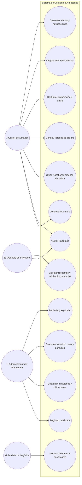
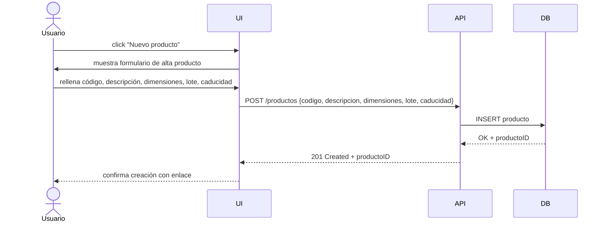
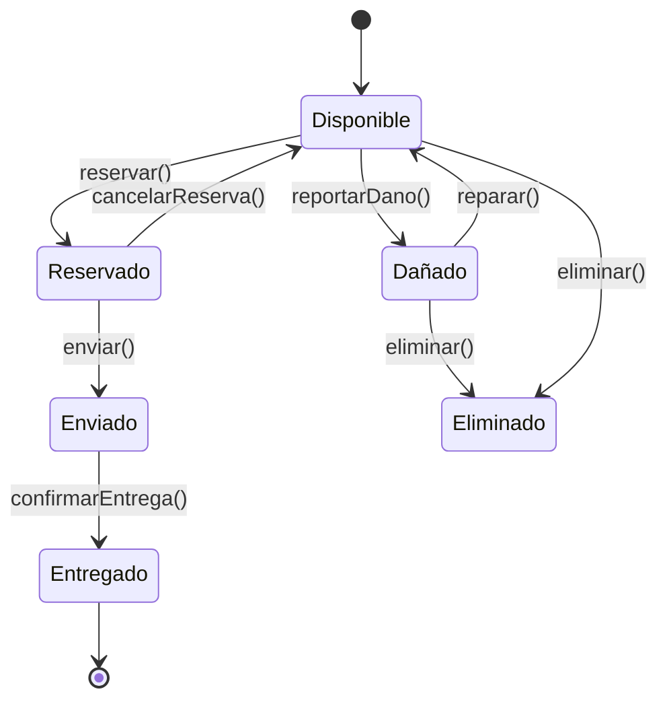

#  Plataforma Web de Gestión Integral de Almacenes y Stock.


# Descripción General.

Desarrollar una plataforma web donde los usuarios puedan registrarse e iniciar sesión, y una vez autenticados crear, editar, archivar o eliminar sus propios posts. Cada post incluirá un título, cuerpo y etiquetas, y podrá verse en un listado paginado y filtrado por etiquetas. Los usuarios también podrán comentar en los posts publicados. Habrá un rol de “Administrador” con capacidad adicional de moderar contenido (eliminar posts o comentarios inapropiados).


---


## 2. Objetivos del Proyecto

| **ID** | **Objetivo SMART**                                                                   | **Tipo**    | **Métrica**                        | **Fecha Límite** | **Responsable**             | **Estado**  |
| ------ | ------------------------------------------------------------------------------------ | ----------- | ---------------------------------- | ---------------- | --------------------------- | ----------- |
| OBJ-01 | Implementar el módulo de control de inventario con stock en tiempo real en 3 meses.  | Estratégico | % de funcionalidades implementadas | 2025-08-15       | Gestor de Almacén           | No iniciado |
| OBJ-02 | Reducir en un 80 % los errores de inventario físico vs sistema en 6 meses.           | Estratégico | Tasa de discrepancias              | 2025-11-15       | Operario de Inventario      | No iniciado |
| OBJ-03 | Activar alertas automáticas por stock mínimo en al menos 90 % de productos críticos. | Táctico     | % de productos con alertas activas | 2025-09-30       | Administrador de Plataforma | En progreso |
| OBJ-04 | Optimizar rutas de picking con mejora del 30 % en tiempos de preparación.            | Operativo   | Tiempo medio de picking (minutos)  | 2025-10-31       | Gestor de Almacén           | No iniciado |
| OBJ-05 | Generar reportes dinámicos con KPIs logísticos disponibles para análisis mensual.    | Táctico     | Nº de dashboards operativos        | 2025-09-15       | Analista de Logística       | En progreso |
| OBJ-06 | Garantizar autenticación multifactor para todos los usuarios antes del go-live.      | Operativo   | % de cuentas con MFA activado      | 2025-08-01       | Administrador de Plataforma | No iniciado |
| OBJ-07 | Asegurar visibilidad del stock 24/7 con disponibilidad del sistema ≥ 99,5 %.         | Estratégico | % de uptime mensual                | 2025-12-31       | Equipo de Infraestructura   | No iniciado |


## 3. Requisitos Funcionales

| **ID** | **Descripción**                                                                                      | **Prioridad** | **Fuente**          | **Estado** |
| ------ | ---------------------------------------------------------------------------------------------------- | ------------- | ------------------- | ---------- |
| RF-01  | Registro y alta de productos con atributos (código, descripción, dimensiones, lote y caducidad).     | Alta          | Requisitos internos | Propuesto  |
| RF-02  | Gestión de múltiples almacenes y ubicaciones internas (pasillos, estantes, zonas de picking).        | Alta          | Requisitos internos | Propuesto  |
| RF-03  | Control de niveles de stock en tiempo real y acceso a vistas históricas de movimientos.              | Alta          | Requisitos internos | Propuesto  |
| RF-04  | Realizar ajustes de inventario: recepciones, traslados internos, mermas y devoluciones.              | Alta          | Requisitos internos | Propuesto  |
| RF-05  | Crear y gestionar órdenes de salida para clientes o producción.                                      | Alta          | Requisitos internos | Propuesto  |
| RF-06  | Generar listados de picking con rutas optimizadas para la preparación de pedidos.                    | Media         | Requisitos internos | Propuesto  |
| RF-07  | Confirmar preparación, embalaje y expedición de pedidos.                                             | Media         | Requisitos internos | Propuesto  |
| RF-08  | Integración con transportistas para etiquetas y seguimiento de envíos.                               | Media         | Requisitos internos | Propuesto  |
| RF-09  | Generar alertas automáticas ante umbrales mínimos o máximos de stock.                                | Alta          | Requisitos internos | Propuesto  |
| RF-10  | Enviar notificaciones por correo o interfaz ante incidencias como recepciones tardías o caducidades. | Media         | Requisitos internos | Propuesto  |
| RF-11  | Ejecutar recuentos cíclicos y validar discrepancias de inventario.                                   | Media         | Requisitos internos | Propuesto  |
| RF-12  | Acceso a dashboards y generación de informes personalizables con KPIs.                               | Media         | Requisitos internos | Propuesto  |
| RF-13  | Control de accesos por rol con autenticación multifactor.                                            | Alta          | Requisitos internos | Propuesto  |
| RF-14  | Registro de auditoría de acciones críticas (quién, cuándo, qué cambió).                              | Media         | Requisitos internos | Propuesto  |


## 4. Requisitos No Funcionales

| **ID** | **Descripción**                                                          | **Categoría**  | **Métrica**                    | **Nivel Objetivo**    | **Comentarios**                           |
| ------ | ------------------------------------------------------------------------ | -------------- | ------------------------------ | --------------------- | ----------------------------------------- |
| RNF-01 | Tiempo de respuesta del sistema < 200 ms para operaciones de inventario. | Rendimiento    | Latencia HTTP                  | < 200 ms              | Medición con pruebas de carga.            |
| RNF-02 | Soportar al menos 1 000 usuarios concurrentes.                           | Escalabilidad  | Usuarios concurrentes          | ≥ 1 000               | Autoescalado en la nube.                  |
| RNF-03 | Cumplir HTTPS/TLS para todas las comunicaciones.                         | Seguridad      | Cifrado                        | TLS 1.2+ obligatorio  | Auditorías de seguridad trimestrales.     |
| RNF-04 | Cumplir WCAG 2.1 AA en interfaz de usuario para accesibilidad.           | Usabilidad     | Puntuación auditoría accesible | Nivel AA              | Auditoría externa antes del lanzamiento.  |
| RNF-05 | Disponibilidad ≥ 99,5 % mensual del sistema.                             | Disponibilidad | % Uptime                       | ≥ 99,5 %              | Monitorización continua y alertas.        |
| RNF-06 | Tiempo de carga inicial de la aplicación ≤ 1 s.                          | Rendimiento    | Tiempo de carga                | ≤ 1 s                 | Uso de CDN y optimización de recursos.    |
| RNF-07 | Encriptación de datos sensibles en tránsito y reposo.                    | Seguridad      | Cifrado                        | AES-256 o equivalente | Protección avanzada de datos.             |
| RNF-08 | Registro de auditorías accesible y no modificable.                       | Seguridad      | Integridad de logs             | 100 % integridad      | Garantía de no repudio.                   |
| RNF-09 | Escaneo rápido y eficiente de códigos de barras y RFID.                  | Rendimiento    | Tiempo de escaneo              | ≤ 0,5 s por artículo  | Optimización del hardware y software.     |
| RNF-10 | Exportación de reportes en formatos CSV y PDF.                           | Usabilidad     | Formatos compatibles           | CSV, PDF              | Compatibilidad con herramientas estándar. |


## 5. Diagrama de Casos de Uso



## 6. Matriz de Trazabilidad

| **Req. ID** | **Descripción Req.**                                     | **Objetivo(s)** | **Caso de Uso**                            | **Caso de Prueba**                |
| ----------- | -------------------------------------------------------- | --------------- | ------------------------------------------ | --------------------------------- |
| RF-01       | Registrar productos con atributos                        | OBJ-01, OBJ-02  | C1 (Registrar productos)                   | TP-01: Registro producto          |
| RF-02       | Gestionar almacenes y ubicaciones internas               | OBJ-01, OBJ-02  | C2 (Gestionar almacenes y ubicaciones)     | TP-02: Gestión almacenes          |
| RF-03       | Controlar inventario en tiempo real                      | OBJ-01, OBJ-02  | C3 (Controlar inventario)                  | TP-03: Control stock              |
| RF-04       | Ajustar inventario (recepciones, traslados)              | OBJ-01          | C4 (Ajustar inventario)                    | TP-04: Ajuste inventario          |
| RF-05       | Crear y gestionar órdenes de salida                      | OBJ-01          | C5 (Crear y gestionar órdenes)             | TP-05: Gestión órdenes            |
| RF-06       | Generar listados de picking con rutas optimizadas        | OBJ-01          | C6 (Generar listados de picking)           | TP-06: Picking optimizado         |
| RF-07       | Confirmar preparación, embalaje y expedición             | OBJ-01          | C7 (Confirmar preparación y envío)         | TP-07: Confirmación envío         |
| RF-08       | Integrar con transportistas para etiquetas y seguimiento | OBJ-01          | C8 (Integrar con transportistas)           | TP-08: Integración transportistas |
| RF-09       | Gestionar alertas y notificaciones automáticas           | OBJ-01          | C9 (Gestionar alertas y notificaciones)    | TP-09: Alertas y notificaciones   |
| RF-10       | Ejecutar recuentos y validar discrepancias               | OBJ-01          | C10 (Ejecutar recuentos)                   | TP-10: Recuentos inventario       |
| RF-11       | Generar informes y dashboards dinámicos                  | OBJ-01, OBJ-04  | C11 (Generar informes y dashboards)        | TP-11: Informes y análisis        |
| RF-12       | Gestionar usuarios, roles y permisos                     | OBJ-03          | C12 (Gestionar usuarios, roles y permisos) | TP-12: Gestión usuarios           |
| RF-13       | Auditoría y seguridad de acciones críticas               | OBJ-03          | C13 (Auditoría y seguridad)                | TP-13: Auditoría y seguridad      |


## 7. Diagrama de Interacción (Secuencia: Crear Producto)




## 8. Diagrama de Estado (Ciclo de vida de un Producto)




## 9. Diagrama de Actividad (Preparar y Enviar Pedido)

```mermaid
flowchart TD

 Inicio((●))
 RecibirOrden([Recibir orden de salida])
 GenerarPicking([Generar listado de picking])
 OptimizarRuta([Optimizar ruta de picking])
 PrepararPedido([Preparar productos])
 ConfirmarPreparacion({¿Pedido completo?})
 EmpacarPedido([Empacar pedido])
 ConfirmarEnvio([Confirmar envío])
 NotificarCliente([Notificar al cliente])
 Fin((◉))

 Inicio --> RecibirOrden
 RecibirOrden --> GenerarPicking
 GenerarPicking --> OptimizarRuta
 OptimizarRuta --> PrepararPedido
 PrepararPedido --> ConfirmarPreparacion
 ConfirmarPreparacion -- No --> PrepararPedido
 ConfirmarPreparacion -- Sí --> EmpacarPedido
 EmpacarPedido --> ConfirmarEnvio
 ConfirmarEnvio --> NotificarCliente
 NotificarCliente --> Fin
 
```