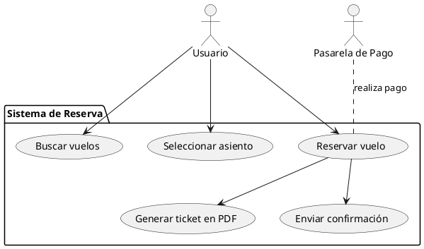
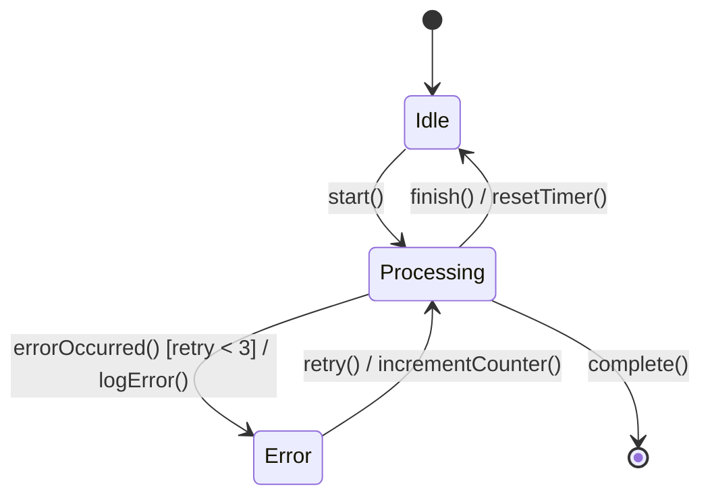
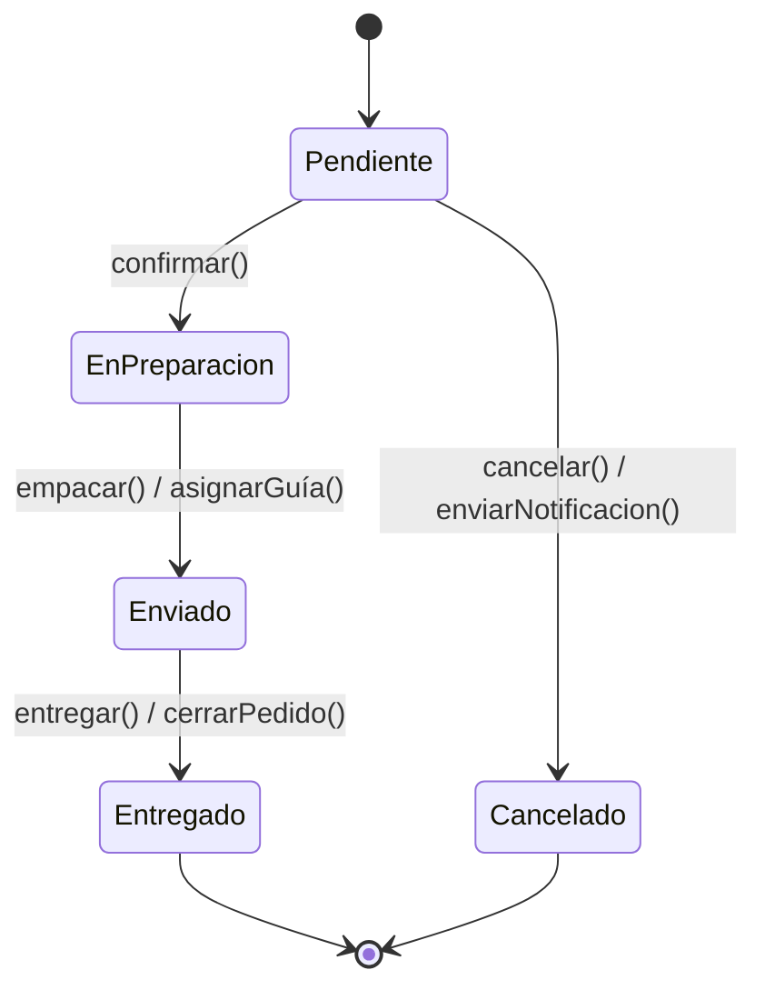
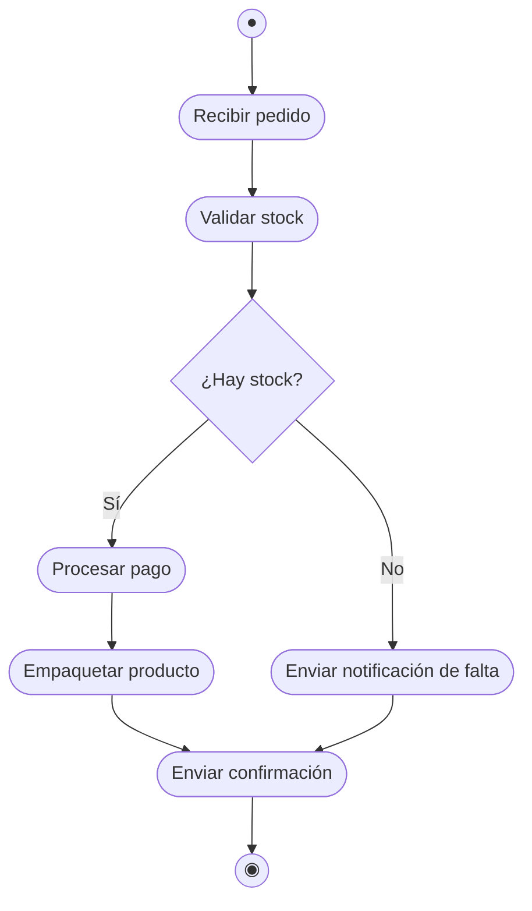

## Introducción
En ingeniería de software, capturar y documentar **requisitos** de forma clara y estructurada es clave para el éxito de cualquier proyecto. Una manera eficaz de hacerlo es mediante **tablas** que agrupen y detallen cada requisito.  

---

## Requisitos

### Requisitos Funcionales
Describen **qué** debe hacer el sistema.  
- Ejemplos: iniciar sesión, buscar datos, procesar pagos.

### Requisitos No Funcionales
Describen **cómo** debe comportarse el sistema o restricciones del mismo.  
- Ejemplos: rendimiento, usabilidad, seguridad, escalabilidad.

---

## ¿Por qué usar tablas?

- **Claridad**: cada requisito está en una fila, con columnas que definen atributos clave.  
- **Trazabilidad**: fácil de relacionar con casos de uso, pruebas o documentos fuente.  
- **Priorización**: visualizar rápidamente la importancia de cada requisito.  
- **Mantenimiento**: actualizar estados, comentarios y métricas de forma sistemática.

---

## Estructura de las Tablas

### Tabla de Requisitos Funcionales
| **Campo**    | **Descripción**                                          |
|--------------|----------------------------------------------------------|
| **ID**       | Código único (p. ej. RF-01)                              |
| **Descripción** | Qué hace el requisito (p. ej. “El sistema permite…”)      |
| **Prioridad**   | Alta / Media / Baja                                     |
| **Fuente**      | Cliente, normativa, stakeholder, etc.                  |
| **Estado**      | Propuesto / Aprobado / Implementado / Verificado       |

### Tabla de Requisitos No Funcionales
| **Campo**      | **Descripción**                                                  |
|----------------|------------------------------------------------------------------|
| **ID**         | Código único (p. ej. RNF-01)                                     |
| **Descripción**   | Comportamiento o restricción (p. ej. “Respuesta < 2 s”)           |
| **Categoría**     | Rendimiento, Seguridad, Usabilidad, Mantenibilidad, etc.       |
| **Métrica**       | Unidad de medida (p. ej. ms, % de error, número de usuarios)  |
| **Nivel Objetivo** | Valor esperado (p. ej. “< 2 s”, “≥ 99 % disponibilidad”)       |
| **Comentarios**   | Detalles adicionales, riesgos o dependencias                  |

---

## Ejemplos

### Caso de Estudio: Sistema de Reserva de Vuelos

#### Requisitos Funcionales

| **ID**   | **Descripción**                                                        | **Prioridad** | **Fuente**    | **Estado**    |
|----------|------------------------------------------------------------------------|---------------|---------------|---------------|
| RF-01    | El usuario puede buscar vuelos por fecha de salida y destino.          | Alta          | Cliente       | Aprobado      |
| RF-02    | El sistema muestra tarifas en la moneda local del usuario.             | Media         | Stakeholder B | Propuesto     |
| RF-03    | Permitirá reservar asiento y generar ticket en PDF.                    | Alta          | Normativa XYZ | Implementado  |
| RF-04    | Enviar confirmación por correo electrónico tras la reserva.            | Alta          | Cliente       | Verificado    |

####  Requisitos No Funcionales

| **ID**    | **Descripción**                                          | **Categoría**    | **Métrica**             | **Nivel Objetivo** | **Comentarios**                           |
|-----------|----------------------------------------------------------|------------------|-------------------------|--------------------|-------------------------------------------|
| RNF-01    | El tiempo de respuesta de la búsqueda debe ser < 2 s.    | Rendimiento      | Tiempo de respuesta     | < 2 segundos       | Evaluar con pruebas de carga periódicas. |
| RNF-02    | La aplicación debe soportar simultáneamente 1 000 usuarios. | Escalabilidad    | Usuarios concurrentes   | ≥ 1 000 usuarios   | Plan de escalado automático en AWS.      |
| RNF-03    | Encriptar datos sensibles en tránsito y reposo.          | Seguridad        | Cifrado AES-256         | Obligatorio        | Cumplir PCI-DSS para pagos.             |
| RNF-04    | La interfaz debe ser accesible según WCAG 2.1 AA.        | Usabilidad       | Puntuación de auditoría | Nivel AA           | Auditoría externa antes del go-live.    |
--- 


# CASOS DE USO


### Definición  
Un **caso de uso** describe una interacción entre uno o varios **actores** y el **sistema** para lograr un objetivo concreto. Sirve para:  
- Capturar requisitos funcionales a nivel de usuario  
- Guiar el diseño de interfaces y flujos  
- Base para pruebas de aceptación  

Cada caso de uso debería incluir al menos:  
- **ID**: Identificador único (p. ej. CU-01)  
- **Nombre**: Breve descripción (p. ej. “Buscar vuelos”)  
- **Actor(es)**: Rol(es) que interactúan  
- **Descripción**: Resumen del propósito  
- **Precondiciones**: Lo que debe cumplirse antes  
- **Flujo principal**: Pasos “felices”  
- **Flujos alternativos**: Desvíos o errores  
- **Postcondición**: Estado tras la ejecución  

---

## Tabla de Ejemplo de Casos de Uso

| **ID** | **Nombre**              | **Actor(es)**         | **Precondición**                                | **Flujo Principal**                                                                                     | **Flujos Alternativos**                                  | **Postcondición**                                |
|--------|-------------------------|-----------------------|-------------------------------------------------|----------------------------------------------------------------------------------------------------------|---------------------------------------------------------|--------------------------------------------------|
| CU-01  | Buscar vuelos           | Usuario               | Usuario autenticado                             | 1. Usuario ingresa origen/destino/fechas<br>2. Sistema muestra lista de vuelos disponibles<br>3. Usuario filtra o selecciona vuelo | 2a. No hay coincidencias → mostrar “sin resultados”      | Se muestra listado de vuelos                     |
| CU-02  | Seleccionar asiento     | Usuario               | CU-01 completado                                | 1. Usuario elige vuelo<br>2. Sistema muestra mapa de asientos<br>3. Usuario selecciona asiento libre        | 2a. Sesión expirada → volver a CU-01                    | Asiento marcado como “reservado temporalmente”   |
| CU-03  | Reservar vuelo          | Usuario, Sistema de Pago | CU-02 completado, tarjeta válida               | 1. Usuario confirma datos<br>2. Sistema envía solicitud de pago<br>3. Pasarela autoriza<br>4. Sistema genera reserva | 2a. Pago rechazado → mostrar error y pedir otro medio   | Reserva creada y persistida en BD               |
| CU-04  | Generar ticket en PDF   | Sistema               | CU-03 exitoso                                   | 1. Sistema recopila datos de reserva<br>2. Genera documento PDF<br>3. Asocia PDF a la reserva                  | —                                                       | Ticket PDF disponible para descarga/envío correo |
| CU-05  | Enviar confirmación     | Sistema, Usuario      | CU-03 exitoso                                   | 1. Sistema envía email con detalles y ticket<br>2. Usuario confirma recepción                               | 1a. Email rebotado → reintentar envío                  | Usuario recibe confirmación por correo          |

---

## Diagrama de Casos de Uso

Ir al siguiente enlace: 
https://editor.plantuml.com/uml/



# OBJETIVOS

Los **objetivos del proyecto** describen los logros clave que el proyecto debe cumplir para considerarse exitoso. Normalmente se formulan siguiendo el criterio **SMART** (Específicos, Medibles, Alcanzables, Relevantes y Temporales).

- **Específicos**: claramente definidos.  
- **Medibles**: con métricas o indicadores.  
- **Alcanzables**: realistas según recursos.  
- **Relevantes**: alineados con la visión del negocio.  
- **Temporales**: con fecha límite.

### ¿Por qué usar tablas?
- **Visibilidad**: todos los stakeholders ven los objetivos en un formato único.  
- **Seguimiento**: fácil de actualizar estado y progreso.  
- **Responsabilidad**: asignación clara de responsables y plazos.  
- **Comunicación**: base para reuniones de seguimiento y reportes.

---

## Estructura de la Tabla de Objetivos

| **Campo**         | **Descripción**                                                             |
|-------------------|-----------------------------------------------------------------------------|
| **ID**            | Código único (p. ej. OBJ-01)                                                |
| **Objetivo**      | Descripción del objetivo (SMART)                                            |
| **Tipo**          | Estratégico / Táctico / Operativo                                            |
| **Métrica**       | Indicador cuantitativo (p. ej. “% de usuarios activos diarios”)              |
| **Fecha Límite**  | Fecha tope para el cumplimiento (YYYY-MM-DD)                                 |
| **Responsable**   | Persona o rol a cargo                                                       |
| **Estado**        | No iniciado / En progreso / Completado / Retrasado                           |

---

## Ejemplo Práctico: Sistema de Reserva de Vuelos

| **ID**   | **Objetivo**                                                                      | **Tipo**       | **Métrica**                          | **Fecha Límite** | **Responsable**     | **Estado**       |
|----------|-----------------------------------------------------------------------------------|----------------|--------------------------------------|------------------|---------------------|------------------|
| OBJ-01   | Incrementar la tasa de conversión de reservas en un 15 % en el primer semestre.   | Estratégico    | Tasa de conversión (%)               | 2025-06-30       | Product Owner       | En progreso      |
| OBJ-02   | Reducir el tiempo medio de búsqueda de vuelos por debajo de 1,5 segundos.         | Operativo     | Tiempo medio de búsqueda (segundos)  | 2025-04-30       | Equipo Backend      | Verificado       |
| OBJ-03   | Lograr ≥ 99,9 % de disponibilidad del servicio en producción.                     | Táctico        | % de disponibilidad mensual          | 2025-12-31       | DevOps              | No iniciado      |
| OBJ-04   | Aumentar la satisfacción de usuarios (CSAT) hasta 4,5/5 en encuestas post-reserva. | Estratégico    | Puntuación CSAT                      | 2025-08-31       | UX / Atención al Cliente | No iniciado  |

---

## Matriz de Trazabilidad

La **matriz de trazabilidad** relaciona de forma bidireccional los requisitos con otros artefactos:  
- **Objetivos**  
- **Casos de uso / diseño**  
- **Casos de prueba**

Ayuda a garantizar que **todos** los requisitos y objetivos estén cubiertos por diseño y pruebas, y facilita el control de cambios.

### Estructura Recomendada

| **Req. ID** | **Descripción Req.**                                   | **Objetivo(s)**   | **Caso de Uso / Diseño**        | **Caso de Prueba**      |
|-------------|--------------------------------------------------------|-------------------|---------------------------------|-------------------------|
| RF-01       | Buscar vuelos por fecha y destino.                     | OBJ-02            | CU-01: Búsqueda de vuelos       | TP-01: Prueba búsqueda  |
| RF-03       | Reservar asiento y generar ticket en PDF.              | OBJ-01, OBJ-04    | CU-03: Reserva y emisión de ticket | TP-03: Prueba reserva  |
| RNF-01      | Respuesta de búsqueda < 2 s.                           | OBJ-02            | Diseño: Caching de resultados   | TP-05: Prueba rendimiento |
| RNF-03      | Cifrado de datos sensibles en tránsito y reposo.       | OBJ-03            | Diseño: TLS + AES-256            | TP-09: Auditoría seguridad |

**Leyenda de columnas**  
- **Req. ID**: Identificador de requisito (funcional o no funcional).  
- **Objetivo(s)**: Vínculo con uno o más objetivos (p. ej. OBJ-02).  
- **Caso de Uso / Diseño**: Referencia al modelo de casos de uso o diagrama de diseño.  
- **Caso de Prueba**: ID del guión de prueba que verifica el requisito.

---

## Pasos para Crear la Matriz

1. **Listar requisitos**: reúne todos los RF y RNF.  
2. **Listar objetivos**: extraídos de la tabla de objetivos.  
3. **Relacionar requisitos–objetivos**: asigna cada requisito a uno o varios objetivos.  
4. **Mapear casos de uso/diseño**: ubica el módulo o flujo que implementa cada requisito.  
5. **Asignar casos de prueba**: define o referencia pruebas automáticas/manuales para cada requisito.  
6. **Revisar cobertura**: asegura que no queden requisitos ni objetivos sin trazabilidad.  
7. **Actualizar**: mantén la matriz viva, actualizando estados y nuevas relaciones.

---


## Diagramas de Estado

 
Los **diagramas de estado** (o **state diagrams**) son parte de la familia de diagramas UML y permiten modelar el comportamiento de un sistema, componente u objeto a lo largo de su ciclo de vida. Reflejan los **estados** por los que puede pasar una entidad, y las **transiciones** disparadas por **eventos**, **condiciones** o **acciones**.

---

## Componentes Básicos

| Elemento          | Descripción                                                                                 |
|-------------------|---------------------------------------------------------------------------------------------|
| **Estado**        | Representa una condición en la que el objeto permanece hasta que ocurre un evento.          |
| **Estado Inicial**| Punto de partida (se dibuja con un círculo relleno o `[ * ]`).                             |
| **Estado Final**  | Condición de terminación (círculo con anillo exterior).                                     |
| **Transición**    | Flecha que une estados, etiquetada con **evento [condición] / acción**.                     |
| **Evento**        | Suceso que desencadena la transición (p. ej. `click()`, `timeout`).                         |
| **Guardia**       | Condición booleana entre corchetes que debe cumplirse para la transición (p. ej. `[x>0]`).  |
| **Acción**        | Operación ejecutada durante la transición (p. ej. `/ iniciarTimer()`).                      |
| **Actividad**     | Comportamiento continuo dentro de un estado (`do / actividad()`).                           |
| **Entrada/Salida**| Acciones ejecutadas al entrar/salir de un estado (`entry /`, `exit /`).                    |

---

## Pasos para Crear un Diagrama de Estado

1. **Identificar la “máquina”:**  
   Elige la clase u objeto cuyos estados modelarás (p. ej. `Pedido`, `Turnstile`, `Semáforo`).

2. **Listar Estados Posibles:**  
   Anota todos los estados significativos (p. ej. `Pendiente`, `Procesando`, `Enviado`, `Cancelado`).

3. **Definir Eventos y Condiciones:**  
   ¿Qué sucesos o inputs modifican el estado? (p. ej. `confirmar()`, `rechazar()`, `timeOut`).

4. **Asignar Transiciones:**  
   Conecta estados mediante flechas, indicando evento / [guardia] / acción.

5. **Marcar Estado Inicial y Final:**  
   Señala con `[ * ]` y `[ * ] --> EstadoInicial` / `EstadoFinal --> [ * ]`.

6. **Revisar y Refinar:**  
   Añade actividades internas, subdivide estados compuestos, verifica que no haya rutas huérfanas.

---

## Sintaxis con Mermaid

Mermaid permite incluir diagramas de estado directamente en Markdown:



## Ejemplo: ciclo de vida de un pedido


 # Diagramas de Interacción


Los **diagramas de interacción** en UML modelan cómo los objetos o componentes colaboran entre sí mediante el intercambio de mensajes para realizar una función. Ayudan a entender el flujo temporal de eventos y responsabilidades, y existen dos tipos principales:

1. **Diagrama de Secuencia**: muestra el orden temporal de los mensajes.  
2. **Diagrama de Comunicación** (o Colaboración): resalta las relaciones estáticas y el orden de mensajes entre objetos.

---

## Componentes Básicos

| Elemento             | Descripción                                                                                       |
|----------------------|---------------------------------------------------------------------------------------------------|
| **Línea de Vida**    | Representa la existencia de un objeto/actor a lo largo del tiempo (línea vertical punteada).      |
| **Actor / Participante** | Objetos o roles que intercambian mensajes.                                                     |
| **Mensaje**          | Flechas etiquetadas para llamadas síncronas (`->>`) o asíncronas (`-->>`), y retornos (`-->>`).  |
| **Fragmentos**       | Bloques para control de flujo: `alt` (alternativa), `loop` (bucles), `opt` (opcionales), etc.      |
| **Nota**             | Comentarios o aclaraciones al margen del diagrama.                                               |

---

## Pasos para Elaborar un Diagrama de Secuencia

1. **Define el Escenario**  
   Selecciona el caso de uso o flujo que vas a modelar (p. ej. “Login de Usuario”, “Reserva de Vuelo”).

2. **Identifica Actores y Participantes**  
   Anota todos los objetos, sistemas o roles involucrados.

3. **Dibuja Líneas de Vida**  
   Coloca los participantes en horizontal con sus líneas de vida verticales.

4. **Añade Mensajes**  
   Mapea el intercambio de información en orden temporal, con flechas etiquetadas:  
   - **Síncrono**: `->>`  
   - **Asíncrono**: `-->>`  
   - **Retorno**: `-->>`

5. **Incluye Fragmentos de Control**  
   Si hay alternativas, bucles o condiciones, usa bloques `alt`, `loop`, `opt`, etc.

6. **Revisa y Refina**  
   Asegúrate de que el diagrama sea claro y muestre el flujo completo sin cruces innecesarios.

---

## Sintaxis con Mermaid: Diagrama de Secuencia

```mermaid
sequenceDiagram
  actor Usuario
  participant UI
  participant Backend
  participant DB

  %% Flujo de Login
  Usuario->>UI: ingresa credenciales<br/>y pulsa "Iniciar sesión"
  UI->>Backend: POST /login {user, pass}
  Backend->>DB: SELECT * FROM usuarios WHERE…
  DB-->>Backend: {id, nombre, rol}
  Backend-->>UI: 200 OK + JWT
  UI-->>Usuario: muestra pantalla principal
  ```

## Ejemplo : Proceso de Reserva
```mermaid
sequenceDiagram
  actor Usuario
  participant UI
  participant ServicioVuelos
  participant PasarelaPago
  participant BaseDatos

  Usuario->>UI: buscarVuelos(origen, destino, fecha)
  UI->>ServicioVuelos: GET /vuelos?origen=…&destino=…&fecha=…
  ServicioVuelos-->>UI: lista de opciones
  UI->>Usuario: mostrarResultados()

  Usuario->>UI: seleccionarVuelo(idVuelo)
  UI->>ServicioVuelos: POST /reserva {vuelo:idVuelo}
  ServicioVuelos->>PasarelaPago: procesarPago(monto)
  PasarelaPago-->>ServicioVuelos: aprobado
  ServicioVuelos->>BaseDatos: INSERT reserva…
  BaseDatos-->>ServicioVuelos: confirmación
  ServicioVuelos-->>UI: reserva confirmada
  UI-->>Usuario: mostrarTicket()
  ```

# Diagramas de Estado

## Tutorial: Cómo Crear Diagramas de Estado

### 1. Introducción  
Un **diagrama de estado** (o *state machine diagram*) de UML describe el comportamiento dinámico de un objeto o sistema, mostrando los **estados** por los que pasa y las **transiciones** disparadas por **eventos**, **guardias** o **acciones**. Son especialmente útiles para modelar:

- Ciclos de vida de instancias (p. ej. órdenes, tickets, sesiones)  
- Máquinas de protocolos o control (p. ej. semáforos, elevadores)  
- Flujos de trabajo con comportamientos complejos  

---

### Componentes Básicos  

| Elemento            | Símbolo / Notación                       | Descripción                                                                                   |
|---------------------|-------------------------------------------|-----------------------------------------------------------------------------------------------|
| **Estado inicial**  | ● (círculo relleno)                      | Punto de partida antes de cualquier evento.                                                  |
| **Estado**          | ◻︎ o rectángulo redondeado               | Condición o situación en la que permanece el objeto hasta que ocurra una transición.         |
| **Estado final**    | ◉ (círculo con anillo)                   | Marca el fin de la máquina de estados.                                                        |
| **Transición**      | Flecha → con etiqueta                    | Conecta estados; etiqueta: `evento [guardia] / acción`.                                       |
| **Evento**          | Nombre de suceso                         | Lo que desencadena la transición (p. ej. `login()`, `timeout`).                               |
| **Guardia**         | `[condición]`                            | Expresión booleana que debe ser verdadera para disparar la transición (p. ej. `[saldo>0]`).  |
| **Acción**          | `/ acción()`                             | Operación ejecutada durante la transición (p. ej. `/ iniciarTimer()`).                        |
| **Actividad interna** | `do / actividad()`                     | Comportamiento continuo mientras el objeto está en ese estado.                                |

---

### Pasos para Diseñar tu Diagrama de Estado

1. **Define el contexto**  
   Elige la clase, componente o proceso a modelar (p. ej. `Pedido`, `SesiónUsuario`, `Ascensor`).

2. **Enumera los estados**  
   Identifica todos los estados relevantes por los que pasa la entidad.

3. **Detecta eventos y guardias**  
   ¿Qué estímulos externos o condiciones internas provocan cambios de estado?

4. **Dibuja transiciones**  
   Conecta cada estado con flechas etiquetadas:  

EstadoA --> EstadoB : evento [guardia] / acción


5. **Marca inicio y fin**  
Añade el nodo de estado inicial (●) apuntando al primer estado y el estado final (◉) desde los últimos estados.

6. **Revisa y refina**  
Asegúrate de cubrir todos los casos: transiciones faltantes, bucles, estados huérfanos, etc.

---

### Sintaxis con Mermaid

```mermaid
stateDiagram-v2
[*] --> Inactivo
Inactivo : do / mostrarPantallaInicio()
Inactivo --> Autenticando : login(usuario, pass)

state Autenticando {
 [*] --> VerificandoCredenciales
 VerificandoCredenciales --> Exitosa : credencialesVálidas()
 VerificandoCredenciales --> Fallida  : credencialesInválidas()
 Fallida --> VerificandoCredenciales : reintentar()
}

Autenticando --> Activo : Exitosa
Activo --> Inactivo : logout()
Activo --> Timeout  : timeout / cerrarSesión()
Timeout --> [*]
```
[ * ] es el estado inicial/final genérico.

Los subestados se agrupan dentro de state Nombre { ... }.

do / … define una actividad continua.

Transiciones pueden volver al mismo estado para bucles.


#  Diagramas de Actividad

En Ingeniería de Software, los **diagramas de actividad** (o *activity diagrams*) de UML son imprescindibles para modelar flujos de trabajo y procesos tanto a nivel de negocio como de sistema. Permiten visualizar de forma clara:  
- El orden de ejecución de tareas.  
- Puntos de decisión y bifurcaciones.  
- Concurrencia y sincronización.  

---

## ¿Qué es un Diagrama de Actividad?  
Un diagrama de actividad representa el **comportamiento dinámico** de un sistema o proceso. Está centrado en la lógica de control: cómo fluye el trabajo de una actividad a otra, cuándo se toman decisiones y cuándo se inicia o finaliza un proceso.

---

## Componentes Básicos  

| Elemento            | Descripción                                                                          |
|---------------------|--------------------------------------------------------------------------------------|
| **Nodo Inicial**    | Punto de partida. Se dibuja como un círculo sólido.                                  |
| **Actividad**       | Acción o tarea. Representada con un rectángulo de esquinas redondeadas.              |
| **Decisión**        | Punto de bifurcación. Rombos con flechas de salida etiquetadas por condición.        |
| **Unión**           | Rombos para converger o sincronizar flujos paralelos.                                |
| **Flujo de Control**| Flechas que indican el orden de ejecución entre nodos.                               |
| **Conectores**      | Círculos pequeños para evitar cruces de líneas o saltos largos en el diagrama.       |
| **Nodo Final**      | Marca el fin del flujo. Representado como un círculo con anillo exterior.           |

---

##  Ventajas de Usar Diagramas de Actividad  
- **Claridad**: visualiza de un vistazo el paso a paso de un proceso.  
- **Comunicación**: facilita que analistas, desarrolladores y testers compartan la misma visión.  
- **Detección de cuellos de botella**: al exponer decisiones y concurrencias.  
- **Documentación viva**: se actualiza con cada cambio en la lógica de negocio.

---

## Pasos para Diseñar tu Diagrama  

1. **Define el alcance**: elige el proceso o caso de uso (p. ej. “Proceso de Pedido”).  
2. **Identifica actividades**: lista cada tarea o acción involucrada.  
3. **Determina puntos de decisión**: ¿cuándo debe bifurcarse el flujo?  
4. **Detecta concurrencias**: si hay actividades que pueden ejecutarse en paralelo.  
5. **Dibuja el flujo básico**: conecta nodos con flechas en orden lógico.  
6. **Añade nodos inicial y final**: para marcar claramente el inicio y cierre del proceso.  
7. **Revisa y afina**: verifica condiciones, etiquetas y legibilidad.

---

## Sintaxis en Mermaid  

Mermaid no tiene un bloque dedicado, pero con un `flowchart` vertical (TD = Top → Down) simulamos un diagrama de actividad:

