# Proyecto Web de Publicación de Posts

Desarrollar una plataforma web donde los usuarios puedan registrarse e iniciar sesión, y una vez autenticados crear, editar, archivar o eliminar sus propios posts. Cada post incluirá un título, cuerpo y etiquetas, y podrá verse en un listado paginado y filtrado por etiquetas. Los usuarios también podrán comentar en los posts publicados. Habrá un rol de “Administrador” con capacidad adicional de moderar contenido (eliminar posts o comentarios inapropiados).

La aplicación contará con control de versiones para borradores, publicación inmediata, sistema de “me gusta” y notificaciones básicas. Se implementará autenticación segura (HTTPS/TLS), cumpliremos estándares de accesibilidad (WCAG 2.1 AA) y mantendremos un rendimiento óptimo (tiempos de respuesta < 200 ms, carga inicial ≤ 1 s), con autoescalado para soportar al menos 1 000 usuarios concurrentes y una disponibilidad mínima del 99,5 %.

---

## 2. Objetivos del Proyecto 

| **ID** | **Objetivo SMART**                                | **Tipo**   | **Métrica**                | **Fecha Límite** | **Responsable**   | **Estado**  |
|----------|------------------------------------------------------------------------------------|---------------|--------------------------------------------|------------------|-----------------------|---------------|
| OBJ-01 | Aumentar a 500 el número de posts publicados en los primeros 3 meses.      | Estratégico | Nº de posts               | 2025-07-28   | Product Owner    | No iniciado |
| OBJ-02 | Lograr un tiempo de carga de página ≤ 1 s al cargar post.             | Táctico   | Tiempo medio de carga (segundos)     | 2025-05-31   | Equipo Frontend   | En progreso |
| OBJ-03 | Garantizar ≥ 99,5 % de disponibilidad del servicio.                | Operativo  | % de uptime mensual            | 2025-12-31   | DevOps        | No iniciado |
| OBJ-04 | Conseguir una satisfacción de usuarios (CSAT) ≥ 4/5 en encuestas post-lanzamiento. | Estratégico | Puntuación CSAT              | 2025-08-31   | UX / Atención al Cliente | No iniciado |

---

## 3. Requisitos Funcionales 

| **ID** | **Descripción**                        | **Prioridad** | **Fuente**     | **Estado**  |
|---------|----------------------------------------------------------------|---------------|---------------------|---------------|
| RF-01 | El usuario puede registrarse e iniciar sesión.        | Alta     | Stakeholder    | Aprobado   |
| RF-02 | El usuario puede crear un nuevo post con título, cuerpo y etiquetas. | Alta   | Cliente      | Aprobado   |
| RF-03 | El usuario puede editar sus posts en estado “Borrador”.    | Media    | Cliente      | Propuesto  |
| RF-04 | El usuario puede publicar o archivar un post.         | Alta     | Requisitos internos | Aprobado   |
| RF-05 | El usuario puede eliminar sus posts.             | Media    | Cliente      | Propuesto  |
| RF-06 | El usuario puede ver lista de posts paginada y filtrada por etiqueta. | Alta  | Stakeholder    | Aprobado   |
| RF-07 | El usuario puede comentar en un post publicado.        | Media    | Cliente      | Aprobado   |
| RF-08 | El administrador puede eliminar comentarios y posts inapropiados. | Alta  | Compliance     | Aprobado   |

---

## 4. Requisitos No Funcionales 

| **ID** | **Descripción**                    | **Categoría**  | **Métrica**         | **Nivel Objetivo**  | **Comentarios**             |
|----------|---------------------------------------------------------|-------------------|------------------------------|-----------------------|------------------------------------------|
| RNF-01 | Tiempo de respuesta del servidor < 200 ms para CRUD de posts. | Rendimiento   | Latencia HTTP        | < 200 ms       | Medir con pruebas de carga.       |
| RNF-02 | Soportar al menos 1 000 usuarios concurrentes.    | Escalabilidad  | Usuarios concurrentes    | ≥ 1 000       | Autoescalado en la nube.        |
| RNF-03 | Cumplir HTTPS/TLS para todas las comunicaciones.   | Seguridad    | Cifrado          | TLS 1.2+ obligatorio | Auditoría de seguridad trimestral.   |
| RNF-04 | Cumplir WCAG 2.1 AA en la interfaz de usuario.    | Usabilidad    | Puntuación auditoría accesible | Nivel AA      | Auditoría externa antes del go-live.  |
| RNF-05 | Disponibilidad ≥ 99,5 % mensual.           | Disponibilidad  | % Uptime          | ≥ 99,5 %       | Monitorización 24/7 con alertas.    |
| RNF-06 | Tiempo de carga de la página inicial ≤ 1 s.      | Rendimiento   | Tiempo de carga       | ≤ 1 s        | Uso de CDN y optimización de assets.  |

---

## 5. Diagrama de Casos de Uso 

```mermaid

flowchart LR

 %% Actores

 U(("👤 Usuario"))
 A(("🛠️ Administrador"))

 %% Sistema

 subgraph "Sistema de Posts"

  C1(("Crear post"))
  C2(("Editar post"))
  C3(("Eliminar post"))
  C4(("Ver posts"))
  C5(("Comentar post"))
  C6(("Gestionar reportes"))

 end

 U --> C1
 U --> C2
 U --> C3
 U --> C4
 U --> C5
 A --> C2
 A --> C3
 A --> C6

```

---

## 6. Matriz de Trazabilidad 

| **Req. ID** | **Descripción Req.**               | **Objetivo(s)** | **Caso de Uso** | **Caso de Prueba** |
|-------------|----------------------------------------------------|-----------------|-----------------|---------------------|
| RF-01   | Registro e inicio de sesión            | OBJ-04     | C4 (Ver posts) + flujo login | TP-01: Registro/Login |
| RF-02   | Crear un nuevo post                | OBJ-01, OBJ-02 | C1       | TP-02: Crear post   |
| RF-03   | Editar post en borrador              | OBJ-01     | C2       | TP-03: Editar post  |
| RF-04   | Publicar o archivar post             | OBJ-01     | C1, C2     | TP-04: Publicar/Archivar |
| RF-06   | Ver lista paginada y filtrada por etiqueta    | OBJ-02     | C4       | TP-05: Listar posts  |
| RF-07   | Comentar post publicado              | OBJ-01     | C5       | TP-06: Comentar post |
| RF-08   | Eliminar contenido inapropiado          | OBJ-03, OBJ-04 | C6       | TP-07: Moderar contenido |

---

## 7. Diagrama de Interacción (Secuencia: Crear Post) 

```mermaid

sequenceDiagram
 actor Usuario
 participant UI
 participant API
 participant DB

 Usuario->>UI: click “Nuevo post”
 UI->>Usuario: muestra formulario
 Usuario->>UI: rellena título, cuerpo, etiquetas
 UI->>API: POST /posts {title, body, tags}
 API->>DB: INSERT post (status="Borrador")
 DB-->>API: OK + postID
 API-->>UI: 201 Created + postID
 UI-->>Usuario: confirma creación con enlace

```

---

## 8. Diagrama de Estado (Ciclo de vida de un Post) 

---

## 9. Diagrama de Actividad (Publicar Post) 

```mermaid

flowchart TD

 Inicio((●))
 Form([Mostrar formulario de post])
 Validar([Validar campos])
 Decidir{¿Todos los campos válidos?}
 Guardar([Guardar en Borrador])
 Publicar([Cambiar a estado “Publicado”])
 Notificar([Notificar suscriptores])
 Fin((◉))

 Inicio --> Form
 Form --> Validar
 Validar --> Decidir
 Decidir -- No --> Guardar
 Decidir -- Sí --> Publicar
 Guardar --> Fin
 Publicar --> Notificar
 Notificar --> Fin
```

